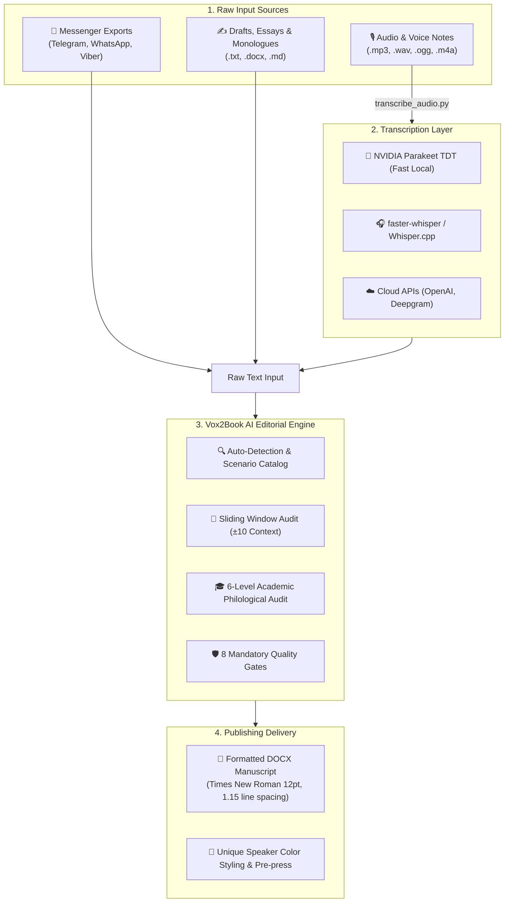

<div align="center">

# 📚 Vox2Book

### *Universal AI Editorial Engine & Pre-press Publishing Pipeline*
### *Универсальный ИИ-редактор и издательский конвейер вычистки рукописей*
### *Універсальний ШІ-редактор та видавничий конвеєр вичитки рукописів*

<br/>

[](https://github.com/kir-spec/Vox2Book/releases)
[](#-languages--языки--мови)
[](docs/ru/AUDIO_TRANSCRIPTION.md)
[](AGENTS.md)
[](LICENSE)

<br/>

**[🇷🇺 Русский](#-русский)** • **[🇬🇧 English](#-english)** • **[🇺🇦 Українська](#-українська)** • **[AGENTS.md](AGENTS.md)**

---

</div>

## 🌐 Languages / Языки / Мови

| Language | Description | Quick Start Prompt | System Prompt | Documentation |
|:---|:---|:---|:---|:---|
| 🇷🇺 **Русский** | Главная локаль издания | [`START_USER_PROMPT.md`](prompts/ru/START_USER_PROMPT.md) | [`UNIVERSAL_EDITOR_SYSTEM.md`](prompts/ru/UNIVERSAL_EDITOR_SYSTEM.md) | [`docs/ru/`](docs/ru/) |
| 🇬🇧 **English** | Target publishing locale | [`START_USER_PROMPT.md`](prompts/en/START_USER_PROMPT.md) | [`UNIVERSAL_EDITOR_SYSTEM.md`](prompts/en/UNIVERSAL_EDITOR_SYSTEM.md) | [`docs/en/`](docs/en/) |
| 🇺🇦 **Українська** | Цільова видавнича локаль | [`START_USER_PROMPT.md`](prompts/uk/START_USER_PROMPT.md) | [`UNIVERSAL_EDITOR_SYSTEM.md`](prompts/uk/UNIVERSAL_EDITOR_SYSTEM.md) | [`docs/uk/`](docs/uk/) |

---

## ⚡ Workflow Architecture



---

## 🇷🇺 Русский

### Что такое Vox2Book

**Vox2Book** — профессиональный **издательский комплект для ИИ-ассистентов**: система промптов, академических правил вычитки и автоматизированных скриптов, превращающая **сырые диктовки, голосовые сообщения и экспорты чатов** в **готовые книжные макеты DOCX**.

> [!IMPORTANT]
> **Смысловая неприкосновенность (100% смысловой паритет):** Запрещено выдумывать детали или угадывать факты. Все исправления STT-омофонов и ослышек производятся **исключительно с опорой на контекстное окно ±10 реплик**.

### Ключевые возможности

- 🎙️ **Встроенная локальная транскрибация:** поддержка **NVIDIA Parakeet TDT ONNX** (ультра-быстро) и `faster-whisper` (`large-v3-turbo`).
- 🤖 **Авто-определение (One-Click Launch):** алгоритм `tools/auto_detect.py` сам определяет жанр (проза, поэзия, диалог, академическая статья, код), стиль и необходимые операции.
- 🎨 **Допечатная верстка (Pre-press Layout):** очистка от машинного мусора, ссылок и плашек ботов (`@TopSaversBot`, `720p`), удаление `Спикер [HH:MM]`, уникальная цветовая стилизация спикеров.
- 🔞 **Политика нецензурной лексики (`keep_mat=True`):** 100% сохранение авторского колорита и живой речи по умолчанию.
- 📚 **Постраничная вычитка (Paginated Batching):** регламент безопасной вычистки крупных книг (300+ стр.) батчами 10 / 3–5 / 1–2 страниц.

### Быстрый старт (За 1 минуту)

1. Положите исходный файл в `inputs/raw_texts/` (или аудио в `inputs/audio/`).
2. Скопируйте содержимое [`prompts/ru/START_USER_PROMPT.md`](prompts/ru/START_USER_PROMPT.md) в чат с ИИ (Cursor, Claude, ChatGPT, VS Code, LM Studio).
3. Напишите одну команду:
   ```text
   Вычитай: [ИМЯ_ФАЙЛА]
   ```
4. Заберите верстанную книгу из **`output/books/<имя>.docx`**.

### Локальная транскрибация аудио (STT)

```bash
# 1. Установка стека Parakeet (рекомендуется, супер-быстро):
python tools/transcribe_audio.py --install-parakeet

# 2. Распознавание аудио в текст:
python tools/transcribe_audio.py inputs/audio/voice.ogg --language ru
```

---

## 🇬🇧 English

### What is Vox2Book

**Vox2Book** is an enterprise-grade **publishing kit for AI assistants**: prompts, academic editorial specs, and automated workflows that transform **raw voice dictations, transcriptions, and chat exports** into **publication-ready DOCX manuscripts**.

> [!NOTE]
> **Semantic Fidelity (100% Meaning Parity):** Never invent facts or hallucinate details. All STT homophone restorations are strictly validated against a **sliding context window of at least 10 turns BEFORE and 10 turns AFTER**.

### Key Features

- 🎙️ **Local STT Backends:** Integrated support for **NVIDIA Parakeet TDT ONNX** (ultra-fast CPU/GPU) and `faster-whisper` (`large-v3-turbo`).
- 🤖 **Auto-Detection Engine:** Heuristic detector (`tools/auto_detect.py`) determines genre, target style mode, and required pipeline passes automatically.
- 🎨 **Pre-press Layout & Styling:** Cleans machine noise, bot metadata (`@TopSaversBot`, `720p`), formats direct speech (`— Dialogue text. — Speaker.`), and applies custom speaker color coding.
- 🗣️ **Profanity Retention (`keep_mat=True`):** Preserves authentic oral disfluencies, slang, and informal voice by default.
- 📄 **Paginated Batching Protocol:** Safe proofreading for long books (300+ pages) via 10 / 3–5 / 1–2 page batching passes.

### Quick Start (1 Minute)

1. Place your raw text in `inputs/raw_texts/` (or audio in `inputs/audio/`).
2. Copy [`prompts/en/START_USER_PROMPT.md`](prompts/en/START_USER_PROMPT.md) into your AI workspace (Cursor, Claude, ChatGPT, VS Code, LM Studio).
3. Send a single command:
   ```text
   Proofread: [FILENAME]
   ```
4. Pick up your manuscript from **`output/books/<filename>.docx`**.

### Audio Transcription (STT)

```bash
# 1. Install Parakeet stack (Recommended):
python tools/transcribe_audio.py --install-parakeet

# 2. Transcribe audio to raw text:
python tools/transcribe_audio.py inputs/audio/dictation.mp3 --language en
```

---

## 🇺🇦 Українська

### Що таке Vox2Book

**Vox2Book** — професійний **видавничий комплект для ШІ-асистентів**: система промптів, філологічних правил вичитки та автоматизованих скриптів, яка перетворює **сирі надиктовки, голосові повідомлення та експорти чатів** на **оформлені книжкові макети DOCX**.

> [!TIP]
> **Змістова недоторканність:** 100% збереження фактажу та авторського задуму. Відновлення слів після розпізнавання мовлення виконується **виключно в контексті ±10 сусідніх реплік**.

### Ключові можливості

- 🎙️ **Локальна транскрибація:** підтримка **NVIDIA Parakeet TDT ONNX** (надшвидко) та `faster-whisper`.
- 🤖 **Авто-визначення сценарію:** модуль `tools/auto_detect.py` самостійно аналізує жанр (проза, поезія, драма, стаття, код) та обирає оптимальний план редагування.
- 🎨 **Додрукарська верстка (Pre-press):** очищення від веб-посилань, бот-вивантажень (`720p`, `@TopSaversBot`), форматування прямої мови та індивідуальне колірне оформлення спікерів.
- 🛡️ **6 рівнів академічного філологічного аудиту** та **8 обов'язкових контрольних перевірок**.

### Швидкий старт

1. Покладіть файл у `inputs/raw_texts/` (або аудіо у `inputs/audio/`).
2. Скопіюйте [`prompts/uk/START_USER_PROMPT.md`](prompts/uk/START_USER_PROMPT.md) у чат із ШІ.
3. Надішліть команду:
   ```text
   Вичитай: [ІМ'Я_ФАЙЛУ]
   ```
4. Заберіть готову книгу з **`output/books/<ім'я>.docx`**.

---

## 📁 Repository Structure

```text
Vox2Book/
├── AGENTS.md                          ← Entry point & system instructions for AI Agents
├── prompts/                           ← Multilingual AI Prompts & Guides
│   ├── ru/                            ← Russian prompts (START, SYSTEM, WORKFLOW)
│   ├── en/                            ← English prompts (START, SYSTEM, WORKFLOW)
│   ├── uk/                            ← Ukrainian prompts (START, SYSTEM, WORKFLOW)
│   └── glossary/                      ← Universal Specs, Homophone Tables & Audit Guides
├── docs/                              ← Detailed Technical Documentation (RU / EN / UK)
├── tools/                             ← Python Automation Scripts & STT Loaders
│   ├── transcribe_audio.py            ← STT Engine (Parakeet TDT / faster-whisper)
│   ├── auto_detect.py                 ← Pure Heuristic Genre/Style Detector
│   └── install_parakeet.ps1           ← Parakeet ONNX Installer
├── inputs/
│   ├── audio/                         ← Input audio files (.mp3, .wav, .ogg, .m4a)
│   └── raw_texts/                     ← Raw text transcripts & drafts
├── config/                            ← User Glossaries & Color Configurations
└── output/books/                      ← Finished Publication-Ready DOCX Manuscripts
```

---

<div align="center">

**[AGENTS.md](AGENTS.md)** • **[Documentation](docs/ru/TECHNICAL_SPECIFICATION.md)** • **[MIT License](LICENSE)**

</div>
